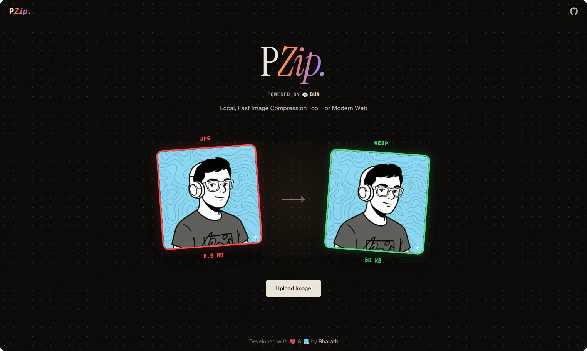

<div align="center">

# PZip

Local & Fast Image Compression App Built with Bun.Image



</div>

## Workflow

- Drag & drop uploads with `XMLHttpRequest` progress tracking.
- Bun backend stores temp files & extracts metadata via `Bun.file().image().metadata()`.
- Native `Bun.Image` pipeline handles resize, format conversion, aspect-ratio locking & compression.
- Optimized binary response returned with auto temp-file cleanup.

## Stack

- **Runtime:** Bun
- **Frontend:** React 19
- **Language:** TypeScript
- **Styling:** Cascading Stylesheets 3

## Dev Setup

Ensure you have Bun installed.

Download the Repo

```bash
git clone https://github.com/bharathajjarapu/PZip.git
```

1. **Install dependencies**:
```bash
bun install
```

2. **Start the development server**:
```bash
bun run dev
```

## Production Build

```bash
bun run build
```

## Contributing

Contributions are always welcome! Feel free to open issue or submit a pull request.

## Support

If you find this project useful, please consider giving it a star ⭐ !

## Author

Built with ❤️ & 💻 by [Bharath Ajjarapu](https://github.com/bharathajjarapu)

## License

This project is licensed under the MIT License - see the [LICENSE](LICENSE) file for details.