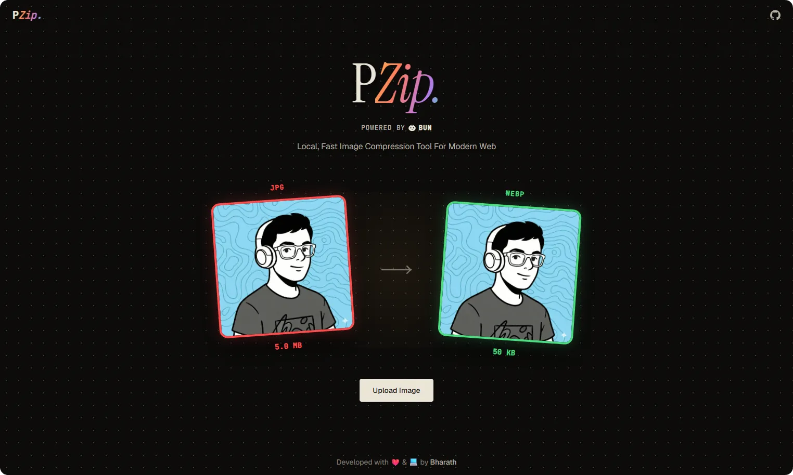

<div align="center">

# PZip

Local & Fast Image Compression App



</div>

## Overview

PZip compresses images entirely in your browser. The file never leaves your device — there's no server, no upload, no round-trip. All decoding, resizing, and re-encoding happens inside a dedicated Web Worker using the browser's native `OffscreenCanvas` API.

## Features

- **Fully client-side** — no server, no network egress, zero image-processing dependencies.
- **Web Worker pipeline** — heavy decode/resize/encode runs off the main thread so the UI stays responsive.
- **Format conversion** — JPEG, PNG, WebP.
- **Resize with aspect-ratio lock** — never upscales, with a 50MP safety cap to prevent OOM on huge images.
- **Try Again** — re-compress the same image with different settings in one click, no re-upload.

## Workflow

1. Pick a file (or click Upload Image).
2. Browser reads the file via `createImageBitmap` to get dimensions and format.
3. Choose output format, optional dimensions, and quality.
4. Worker decodes → resizes on `OffscreenCanvas` → re-encodes via `convertToBlob`.
5. Download the compressed blob, or hit **Try Again** to tweak settings and re-compress.

## Stack

- **Build:** Vite 6
- **Framework:** React 19
- **Language:** TypeScript 5
- **Styling:** CSS3
- **Image pipeline:** `OffscreenCanvas` + `createImageBitmap` + `convertToBlob` inside a Web Worker

## Packages

### Runtime dependencies

| Package | Version | Purpose |
|---|---|---|
| `react` | `^19` | UI framework |
| `react-dom` | `^19` | React DOM renderer |

No image-processing libraries. The image pipeline is 100% browser-native.

### Dev dependencies

| Package | Version | Purpose |
|---|---|---|
| `vite` | `^6` | Dev server, HMR, production bundler |
| `@vitejs/plugin-react` | `^4` | React Fast Refresh + JSX transform |
| `typescript` | `^5` | Type checking |
| `@types/react` | `^19` | React type definitions |
| `@types/react-dom` | `^19` | React DOM type definitions |

## Project structure

```
pzip/
├── index.html               Vite entry, root-level
├── vite.config.ts           React plugin + ESM workers
├── tsconfig.json            lib: ESNext + DOM + WebWorker
├── package.json
├── public/                  Static assets (Favicon, Hero, PZip, Social)
└── src/
    ├── main.tsx             createRoot entry
    ├── App.tsx              Phase state machine + worker roundtrip
    ├── types.ts             Shared types
    ├── index.css            Styling
    ├── components/
    │   ├── Header.tsx
    │   ├── Footer.tsx
    │   ├── Upload.tsx       Reads file, derives ImageInfo via createImageBitmap
    │   ├── Options.tsx      Format/quality/dimensions controls
    │   └── Result.tsx       Preview + Download / Try Again / New Image
    └── workers/
        ├── compress.worker.ts   OffscreenCanvas pipeline
        └── client.ts            Lazy worker + promise multiplexer
```

## Dev setup

Requires Node.js 18+.

```bash
git clone https://github.com/bharathajjarapu/PZip.git
cd PZip
npm install
npm run dev
```

## Production build

Outputs a fully static site to `dist/`. Deploy anywhere — Netlify, Vercel, GitHub Pages, S3, Cloudflare Pages, Render, or any static host.

```bash
npm run build
npm run preview
```

## Scripts

| Script | Description |
|---|---|
| `npm run dev` | Start Vite dev server with HMR |
| `npm run build` | Type-check (`tsc -b`) and build production bundle to `dist/` |
| `npm run preview` | Serve the production `dist/` locally for verification |

## Contributing

Contributions are always welcome. Feel free to open an issue or submit a pull request.

## Support

If you find this project useful, please give it a star.

## Author

Built with care by [Bharath Ajjarapu](https://github.com/bharathajjarapu)

## License

MIT — see [LICENSE](LICENSE).
